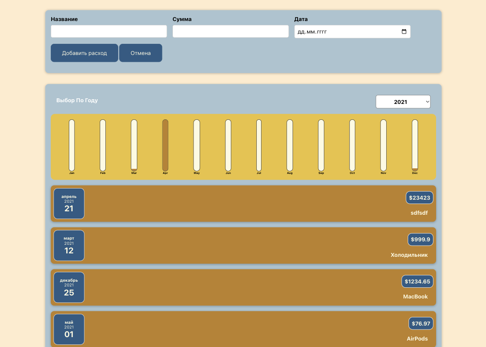
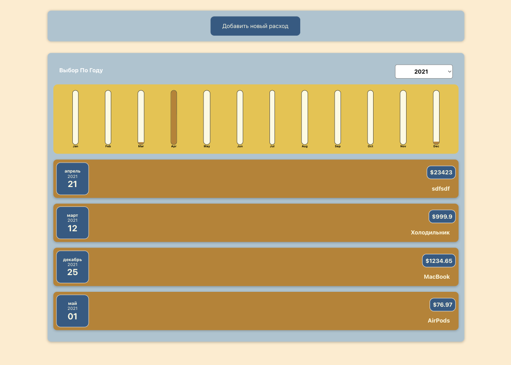

# React Income Tracker App

This mini-application, developed using React, allows users to track their income efficiently. The app features a straightforward interface for adding and viewing income records.

## Features

### 1. Add Income

Easily add new income records by specifying:
- Date of income receipt.
- Source of income (e.g., salary, freelance, investments).
- Income amount.

### 2. View and Filter Data

User-friendly interface for viewing and filtering income records by date, source, or other parameters.

### 3. Charts and Reports

Visualize and analyze income data through built-in charting and reporting functionality.

### 4. Responsive Design

Responsive design ensures a seamless user experience on both desktop and mobile devices.

## Technologies

- **React:** Used for building the user interface and enabling dynamic user interaction.
- **State Management:** Employing state management (e.g., Redux or Context API) for efficient control of the application state.
- **Routing:** React Router for navigation and state management during page transitions.
- **Charts:** Utilizing chart libraries like Chart.js or D3.js for visualizing data.
- **CSS-in-JS:** Styling components using the CSS-in-JS approach (e.g., Styled-components).

## Demo

Explore the live version of the application [HERE](https://kulakovskyi.github.io/cost-accounting/).

## Screenshots

## Getting Started

1. Install dependencies: `npm install`
2. Start the application: `npm start`
3. Open [http://localhost:3000](http://localhost:3000) in your browser.

## Usage

- Add income records using the provided interface.
- View and filter income data as needed.
- Explore charts and reports for better insights into your financial situation.

## Contributing

Feel free to contribute by submitting issues or pull requests.

